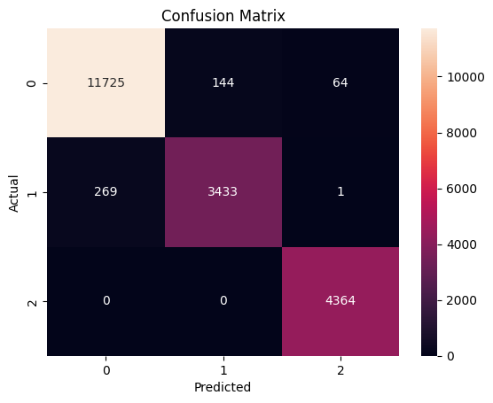
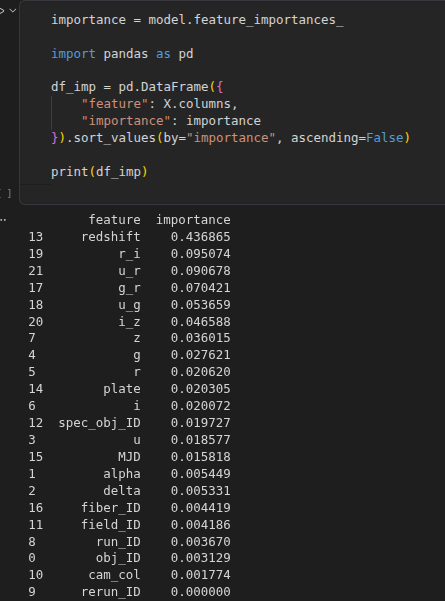

# 🌌 Astronomy Object Classifier

A Machine Learning project that classifies celestial objects into:

- ⭐ Star  
- 🌌 Galaxy  
- 💫 Quasar (QSO)  

---

## 🚀 Live Demo

👉 https://abhi-astrophysics-astronomy-classifier.hf.space/

---

## 🧠 Project Overview

With the explosion of astronomical data from surveys like SDSS, manual classification is no longer practical.  
This project uses Machine Learning to automatically classify celestial objects based on their physical properties.

---

## 📊 Model Performance

- Accuracy: **97.6%**
- Algorithm: **Random Forest**
- Dataset: **SDSS (Sloan Digital Sky Survey)**

---

## 📈 Visualizations

### Confusion Matrix

### Feature Importance

---

## 🔬 Key Insights

- Redshift is the most important feature  
- Color indices (g-r, u-g) improve classification  
- QSOs are hardest to classify  

---

## 🛠 Tech Stack

- Python  
- Pandas  
- Scikit-learn  
- Gradio  

---

## 📂 Project Structure
app.py-Web app
Model.pkl-Trained Model 
Notebook/-Analysis
Images/-visualization

---

---

## 👨‍💻 Author

**Abhishek Pandey**  
Aspiring Astrophysicist 🚀  

---

## 🌟 Future Work

- Deep Learning models  
- Better QSO classification  
- Larger datasets  
