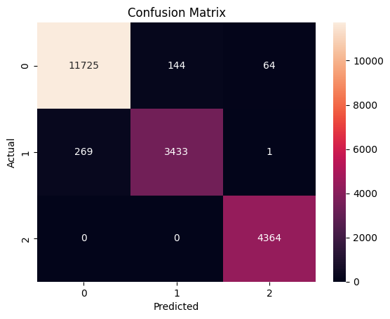
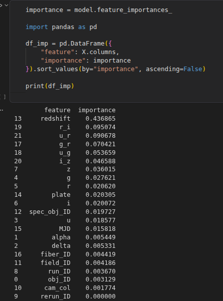

# 🌌 Astronomy Object Classifier

A Machine Learning project that classifies celestial objects into:

- ⭐ Star  
- 🌌 Galaxy  
- 💫 Quasar (QSO)  

---

## 🚀 Live Demo

👉 https://abhi-astrophysics-astronomy-classifier.hf.space/

---

## 🧠 Project Overview

With the explosion of astronomical data from surveys like SDSS, manual classification is no longer practical.  
This project uses Machine Learning to automatically classify celestial objects based on their physical properties.

---

## 📊 Model Performance

- Accuracy: **97.6%**
- Algorithm: **Random Forest**
- Dataset: **SDSS (Sloan Digital Sky Survey)**

---

## 📈 Visualizations

### Confusion Matrix

### Feature Importance

---

## 🔬 Key Insights

- Redshift is the most important feature  
- Color indices (g-r, u-g) improve classification  
- QSOs are hardest to classify  

---

## 🛠 Tech Stack

- Python  
- Pandas  
- Scikit-learn  
- Gradio  

---

## 📂 Project Structure
- `app.py` # Web app
- `save_model.py` # Model training script
- `requirements.txt` # Dependencies
- `data/star_classification.csv` # Dataset
- `notebooks/week1_star_data.ipynb` # Notebook
- `assets/images/image.png` # Confusion matrix
- `assets/images/image-1.png` # Feature importance
- `docs/report.pdf` # PDF report
- `tests/` # Unit tests
---

---

## 🧠 My Approach
- Focused on feature importance
- Used ensemble learning (Random Forest)
- Balanced accuracy with interpretability

---

## ⚠️ Limitations
- Limited to the SDSS dataset
- The model may struggle with unseen data distributions

---

## 📜 Research Paper
👉 Available in this repository (PDF)

---

## 🙋 About Me
I am a Class 12 student passionate about Astronomy and Machine Learning,  
building projects at the intersection of space science and AI.

---

⭐ If you found this interesting, consider giving it a star!
